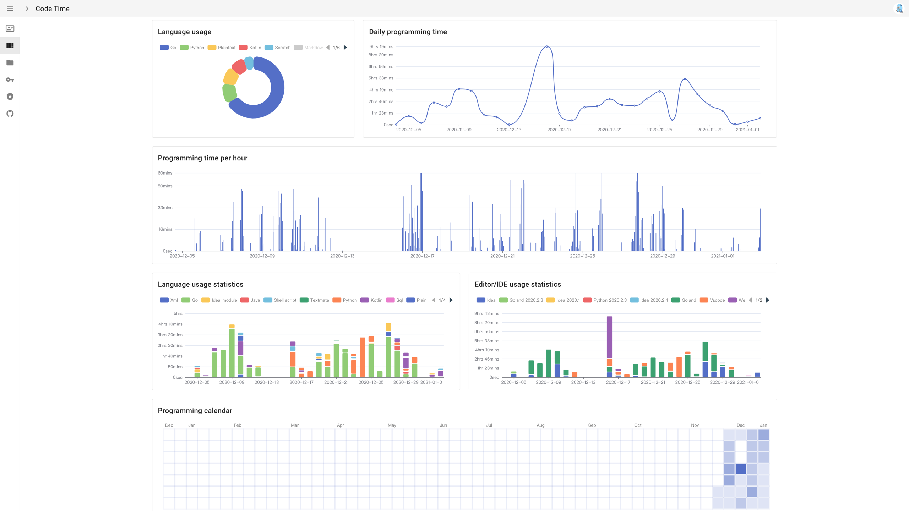
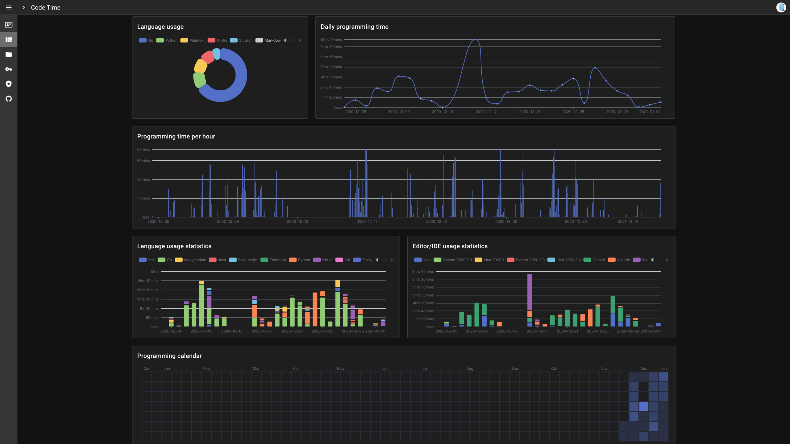
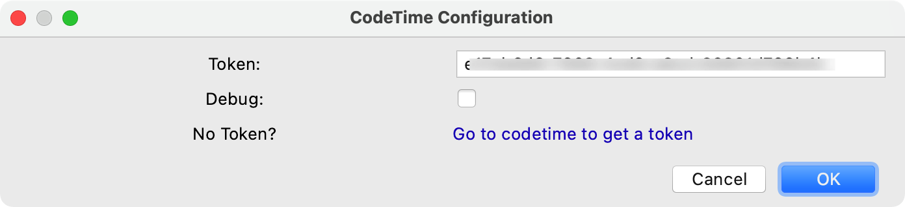

# codetime-jetbrains

<!-- Plugin description -->
[Codetime](https://codetime.datreks.com/) jetbrains plugin. Statistical analysis of your programming time.
<!-- Plugin description end -->

## Support Jetbrains IDES

<!-- Plugin description -->
## Installation

- Using IDE built-in plugin system:

  <kbd>Preferences</kbd> > <kbd>Plugins</kbd> > <kbd>Marketplace</kbd> > <kbd>Search for "codetime"</kbd> >
  <kbd>Install Plugin</kbd>

- Manually:

  Download the [latest release](https://github.com/Data-Trekkers/codetime/releases/latest) and install it manually using
  <kbd>Preferences</kbd> > <kbd>Plugins</kbd> > <kbd>⚙️</kbd> > <kbd>Install plugin from disk...</kbd>

## Usage

- Access https://codetime.datreks.com/ to signup and get an api token

- Restart your IDE after you install plugin

- Enter api token in the CodeTime configuration window

- Visit https://codetime.datreks.com/ to see your code time statistical analysis.

## Configuration

<kbd>Tools</kbd> > <kbd>Codetime Configuration</kbd> > <kbd>Input Token</kbd>
<!-- Plugin description end -->

<!-- Plugin description -->
## Troubleshooting
- Turn debug mode:

  <kbd>Tools</kbd> > <kbd>Codetime Configuration</kbd> > <kbd>Enable Debug Mode</kbd>

- Check Log(idea.log file):

  <kbd>Help</kbd> > <kbd>Show Log</kbd>
<!-- Plugin description end -->

